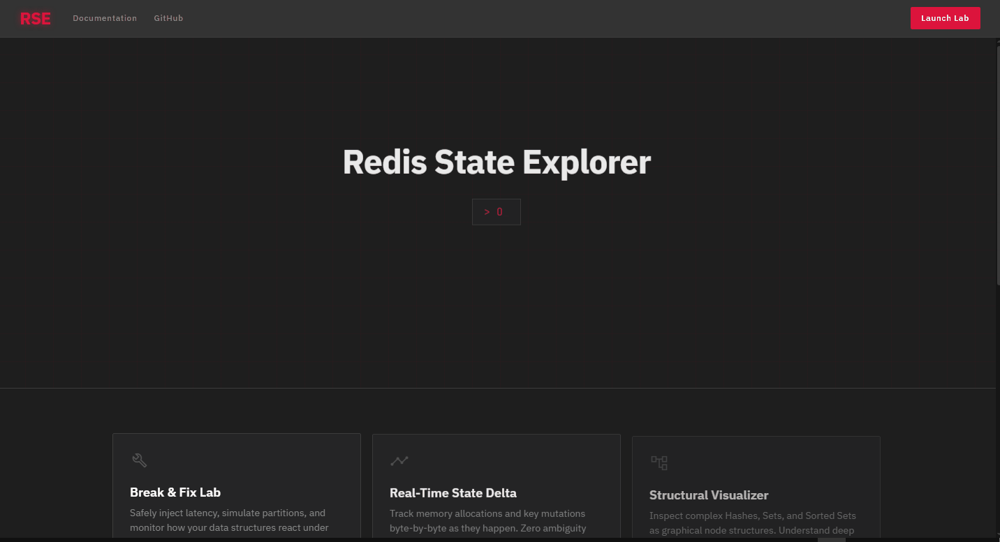
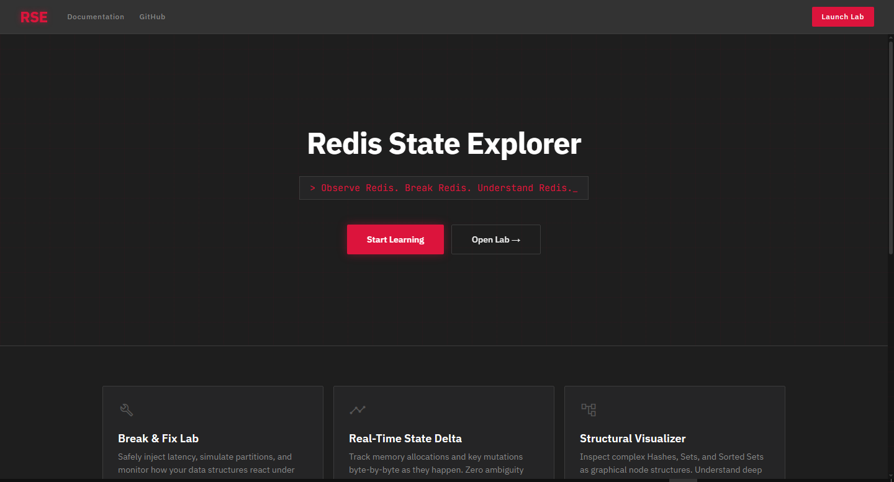
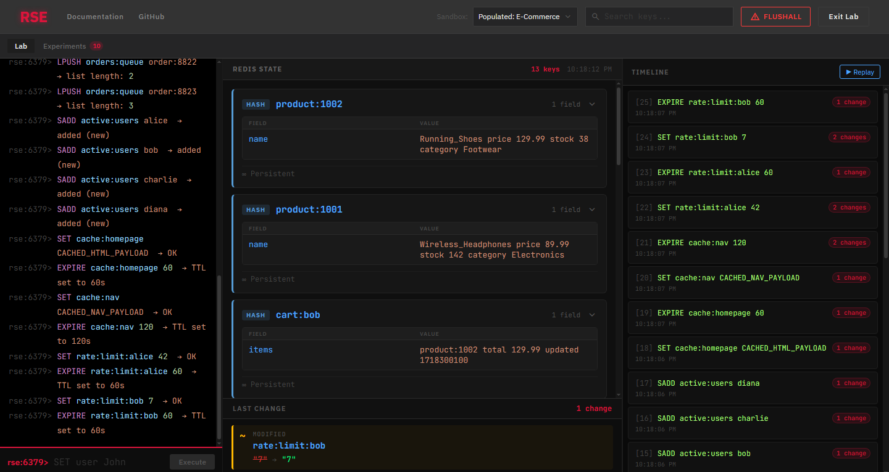
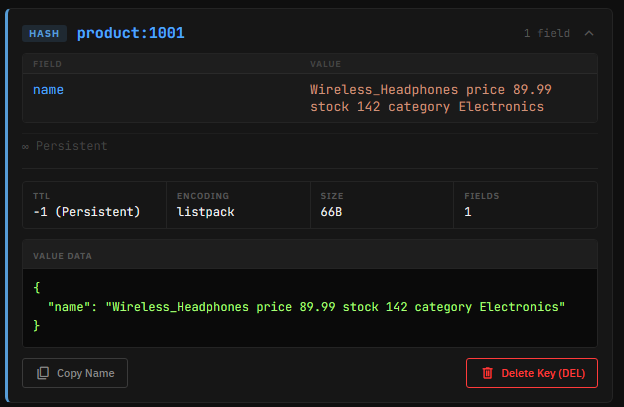
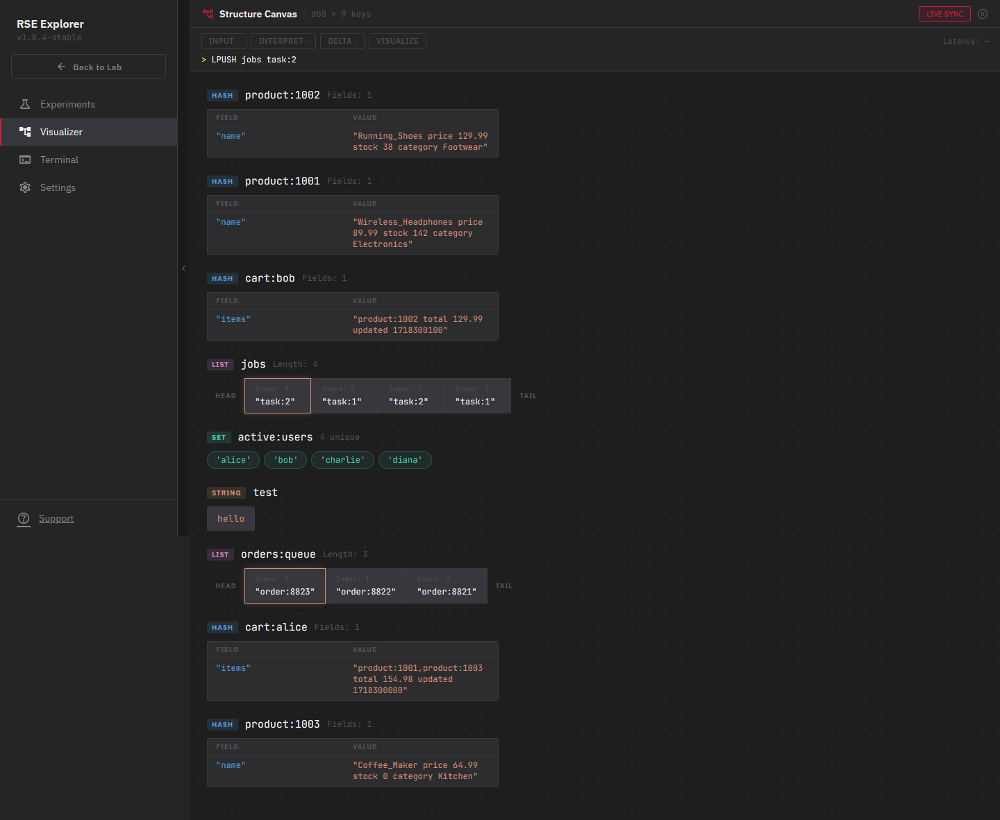
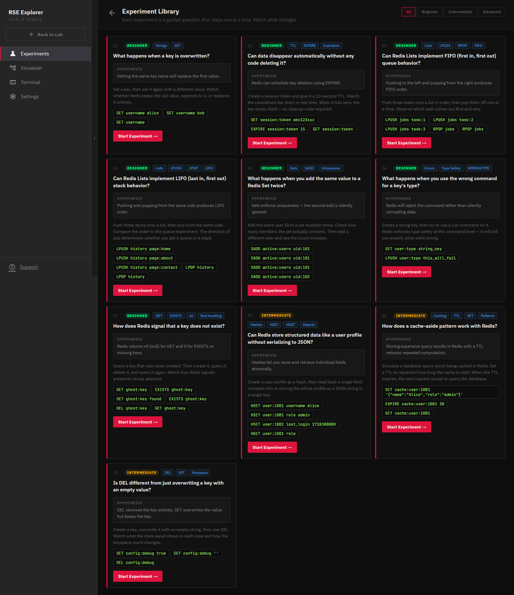
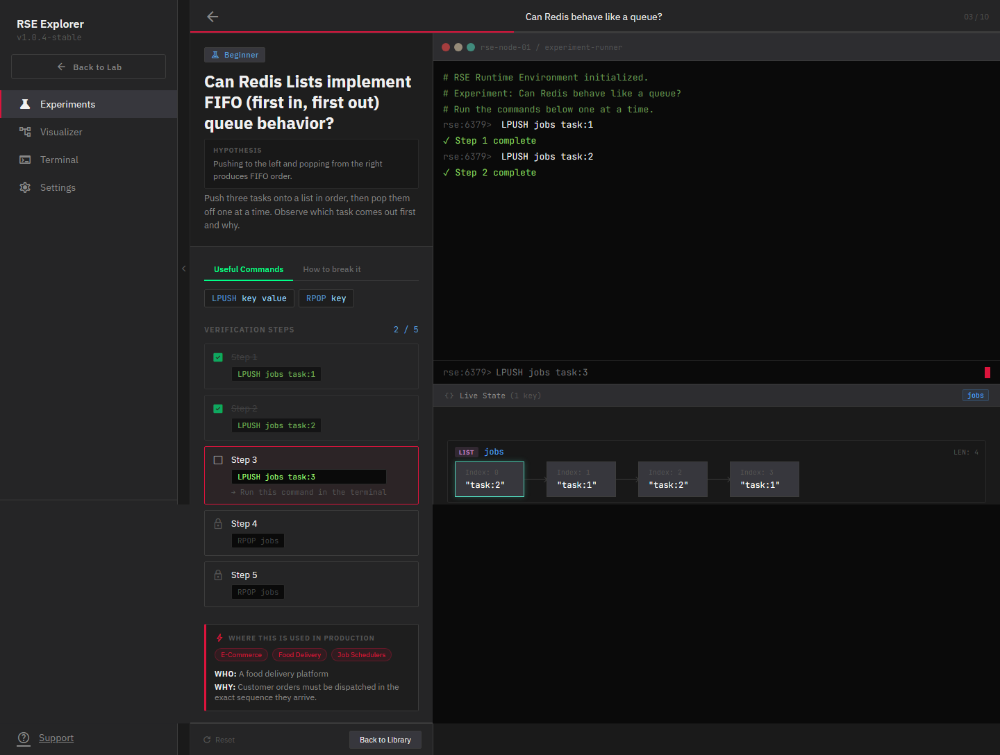

# Redis State Explorer

> **Type a Redis command. Watch exactly what changes and why.**
>

<p align="center">
  
</p>

<p align="center">
  
  
  
  
  
  
</p>

<p align="center">
  <a href="#demo">Demo</a> ·
  <a href="#features">Features</a> ·
  <a href="#getting-started">Getting Started</a> ·
  <a href="#architecture">Architecture</a> ·
  <a href="#roadmap">Roadmap</a> ·
  <a href="#contributing">Contributing</a>
</p>

---

## What is RSE?

Redis State Explorer is an **interactive laboratory** for learning, debugging, and understanding Redis.

Most Redis learning happens through documentation and static examples. RSE takes a different approach: **you run commands, watch state change in real time, and build intuition through observation** rather than memorization.

It was built to answer the questions that documentation doesn't address well:

- Why did RPOP return `task1` instead of `task3`?
- What exactly changes when EXPIRE fires?
- Why does Redis reject LPUSH on a STRING key instead of overwriting it?
- How does a cache-aside pattern actually behave under load?

RSE makes these questions answerable by making Redis visible.

---

## Demo

<!-- Replace with your actual GIF once recorded -->


**[Try it live →](https://your-deployment-url.com)** *(deployment coming soon)*

---

## Screenshots

<table>
  <tr>
    <td align="center">
      
      <br /><sub>Landing Page</sub>
    </td>
    <td align="center">
      
      <br /><sub>Lab Workspace — E-Commerce Sandbox</sub>
    </td>
  </tr>
  <tr>
    <td align="center">
      
      <br /><sub>Key Inspector — HASH accordion view</sub>
    </td>
    <td align="center">
      
      <br /><sub>Structure Visualizer — Execution Trace</sub>
    </td>
  </tr>
  <tr>
    <td align="center">
      
      <br /><sub>Experiment Library — 10 guided modules</sub>
    </td>
    <td align="center">
      
      <br /><sub>Experiment Runner — Queue Manipulation</sub>
    </td>
  </tr>
</table>

---

## Features

### Lab Workspace
- **Live command terminal** with syntax highlighting — keywords, key names, and values are color-coded as you type
- **Real-time keyspace** — state updates within 2 seconds of every command, with smooth per-second TTL countdowns
- **Type-aware cards** — STRING, LIST, HASH, SET each rendered as their actual structure (list nodes with HEAD/TAIL labels, hash field tables, set pills)
- **Mutation flash** — new keys pulse green, modified keys pulse yellow, deleted keys dissolve
- **Key Inspector** — click any card to expand TTL, encoding, size estimate, raw value, and a Delete action
- **Command timeline** — full history of commands with before/after snapshots and one-click replay

### Structure Visualizer
- **Live execution trace** — four-stage pipeline (INPUT → INTERPRET → DELTA → VISUALIZE) pulses in real time as commands run
- **WRONGTYPE banner** — when a type mismatch occurs, a dismissible error banner explains exactly what went wrong and why it matters in production
- **Structure blocks** — STRING, LIST, HASH, SET rendered as diagram nodes with connection arrows, HEAD/TAIL markers, and field tables

### Experiment Library
**10 guided experiments** that teach Redis through discovery, not instruction:

| # | Question | Concepts |
|---|---|---|
| 01 | What happens when a key is overwritten? | Strings, SET |
| 02 | Can data disappear automatically? | TTL, EXPIRE |
| 03 | Can Redis behave like a queue? | Lists, LPUSH, RPOP, FIFO |
| 04 | Can Redis behave like a stack? | Lists, LPUSH, LPOP, LIFO |
| 05 | Why are duplicates ignored? | Sets, SADD, Uniqueness |
| 06 | How can Redis store objects? | Hashes, HSET, HGET |
| 07 | What happens with a WRONGTYPE error? | Type Safety, Errors |
| 08 | Why is Redis used for caching? | Caching, TTL, Patterns |
| 09 | DEL vs overwrite — what is the difference? | DEL, SET, Keyspace |
| 10 | What does Redis return for missing keys? | GET, EXISTS, nil |

Each experiment follows a structured flow: **Question → Hypothesis → Experiment → Observation → Reflection**. A live structure visualizer updates as you type commands, and verification steps track your progress through the module.

### Sandbox Scenarios
Switch between pre-seeded database scenarios from the top navigation:

- **Default / Empty** — clean slate for manual exploration
- **Populated: E-Commerce** — realistic keyspace with session tokens, product hashes, shopping carts, an order queue, active users set, and rate-limit counters with live TTLs
- **Chaos / Heavy Load** — 50+ keys across `tmp:`, `metric:`, and `session:` namespaces with volatile TTLs (5–60s), simulating a production system under pressure

---

## Getting Started

### Prerequisites

- [Node.js](https://nodejs.org/) 18+
- [Redis](https://redis.io/docs/getting-started/) 7+ running locally on port `6379`

The fastest way to get Redis running locally:
```bash
# Docker (recommended)
docker run -d -p 6379:6379 redis:7-alpine

# macOS (Homebrew)
brew install redis && brew services start redis

# Ubuntu/Debian
sudo apt install redis-server && sudo systemctl start redis
```

### Installation

```bash
# 1. Clone the repository
git clone https://github.com/yourusername/redis-state-explorer.git
cd redis-state-explorer

# 2. Install backend dependencies
cd backend
npm install

# 3. Install frontend dependencies
cd ../frontend
npm install
```

### Running

You need two terminals.

**Terminal 1 — Backend:**
```bash
cd backend
npm run dev
# Starts on http://localhost:3000
# Expected: "Connected to Redis" + "RSE backend running on http://localhost:3000"
```

**Terminal 2 — Frontend:**
```bash
cd frontend
npm run dev
# Starts on http://localhost:5173
```

Open `http://localhost:5173` in your browser.

### Verifying the connection

Once both servers are running, click **Launch Lab** from the landing page. Type `SET user John` in the terminal panel and press Enter. The `user` key should appear as a STRING card in the state panel within 2 seconds, flashing green.

If the state panel shows "Keyspace is empty" and commands produce network errors, confirm Redis is running on port `6379`.

---

## Architecture

See [`ARCHITECTURE.md`](ARCHITECTURE.md) for a detailed breakdown of the component tree, data flow, and design decisions.

**High-level overview:**

```
Browser
  └── React App (Vite, TypeScript, plain CSS)
        ├── Shell (tab-state router — no React Router)
        ├── TopNavBar / SideNavBar
        ├── LandingPage
        ├── LabWorkspace
        │     ├── CommandConsole (syntax-highlighted terminal)
        │     ├── StateViewer (type-aware cards + Key Inspector)
        │     ├── DiffPanel (mutation diff)
        │     └── TimelinePanel (command history + replay)
        ├── VisualizerPage (structure canvas + execution trace)
        └── ExperimentPage (library picker + guided runner)

Express API (Node.js, TypeScript)
  └── POST /execute   — runs a Redis command, returns result
  └── GET  /state     — returns full keyspace as typed RedisEntry objects

Redis (local or managed)
```

---

## Repository Structure

```
redis-state-explorer/
├── backend/
│   └── src/
│       ├── index.ts              # Express app entry
│       ├── redis.ts              # Redis client
│       ├── routes/execute.ts     # POST /execute, GET /state
│       └── services/redisService.ts  # Redis operations + state extraction
├── frontend/
│   └── src/
│       ├── components/
│       │   ├── Navigation/       # TopNavBar, SideNavBar
│       │   ├── Layout/           # Shell (tab-state router)
│       │   ├── CommandConsole.tsx
│       │   ├── StateViewer.tsx
│       │   ├── DiffPanel.tsx
│       │   ├── TimelinePanel.tsx
│       │   └── KeyInspector.tsx
│       ├── pages/
│       │   ├── LandingPage.tsx
│       │   ├── LabWorkspace.tsx
│       │   ├── VisualizerPage.tsx
│       │   └── ExperimentPage.tsx
│       ├── hooks/useRedisState.ts  # All live state, polling, diff, replay
│       ├── services/diffEngine.ts  # Snapshot diff computation
│       ├── utils/
│       │   ├── parseCommand.ts     # Command parser
│       │   └── syntaxHighlight.tsx # Token colorizer
│       ├── data/experiments.ts     # 10 experiment definitions
│       └── types/index.ts          # Shared TypeScript types
├── docs/
│   ├── assets/                   # Screenshots and demo GIF
│   ├── ARCHITECTURE.md
│   └── ROADMAP.md
├── README.md
└── LICENSE
```

---

## Tech Stack

| Layer | Technology |
|---|---|
| Frontend | React 19, TypeScript, Vite |
| Styling | Plain CSS (design system in `App.css`) |
| Backend | Node.js, Express, TypeScript |
| Data Layer | Redis 7 |
| Icons | Material Symbols Outlined |
| Fonts | IBM Plex Sans (UI), JetBrains Mono (data) |

---

## Roadmap

See [`ROADMAP.md`](ROADMAP.md) for the full breakdown.

**Current milestone:** Public deployment + screenshots + demo GIF

**Up next:**
- Production deployment (Railway / Render / Fly.io)
- Pub/Sub visualization
- Streams visualization
- Redis persistence and eviction policy simulations

---

## Contributing

Contributions are welcome. RSE is early-stage and there are many surfaces to improve.

**Good first contributions:**
- Add more experiments to `frontend/src/data/experiments.ts` (follow the existing `Experiment` type)
- Improve syntax highlighting for additional Redis commands in `frontend/src/utils/syntaxHighlight.tsx`
- Report bugs or UX issues via [GitHub Issues](https://github.com/yourusername/redis-state-explorer/issues)
- Add support for additional Redis commands in `backend/src/routes/execute.ts`

**Before submitting a PR:**
```bash
# Frontend type check
cd frontend && npx tsc --noEmit

# Backend type check
cd backend && npx tsc --noEmit
```

There are no other required tests at this stage.

---

## License

MIT License - see [`LICENSE`](LICENSE) for details.

---

## Author

**Aditya P. S.**

Building tools for systems, infrastructure, and learning through experimentation.

<p>
  <a href="https://www.linkedin.com/company/redis-state-explorer">LinkedIn</a> ·
  <a href="https://github.com/ps-aditya/redis-state-explorer">GitHub</a>
</p>
